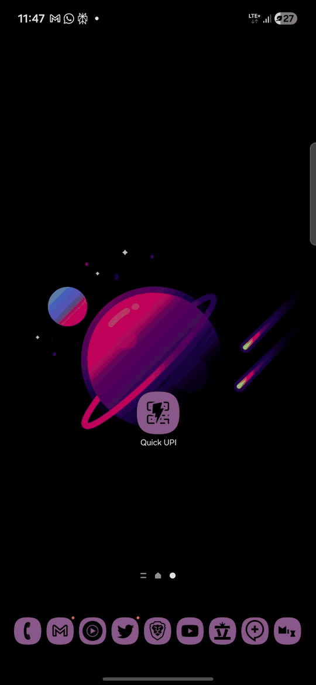
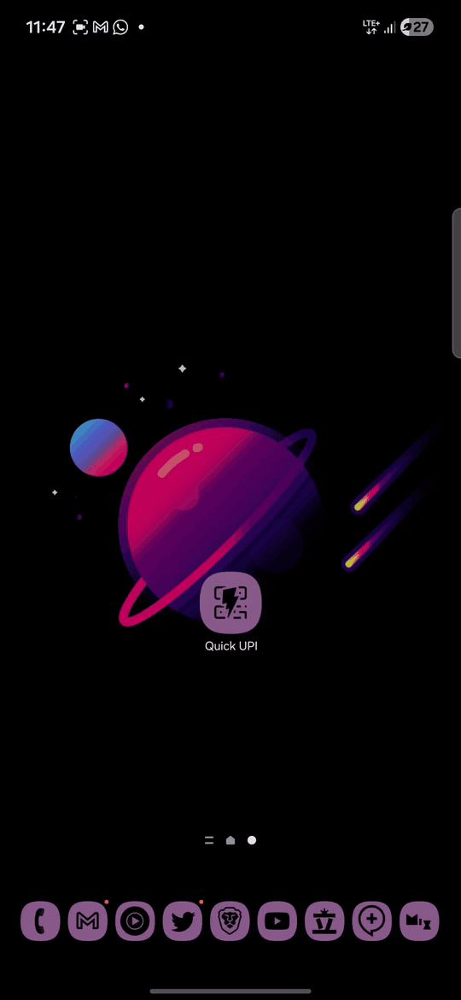
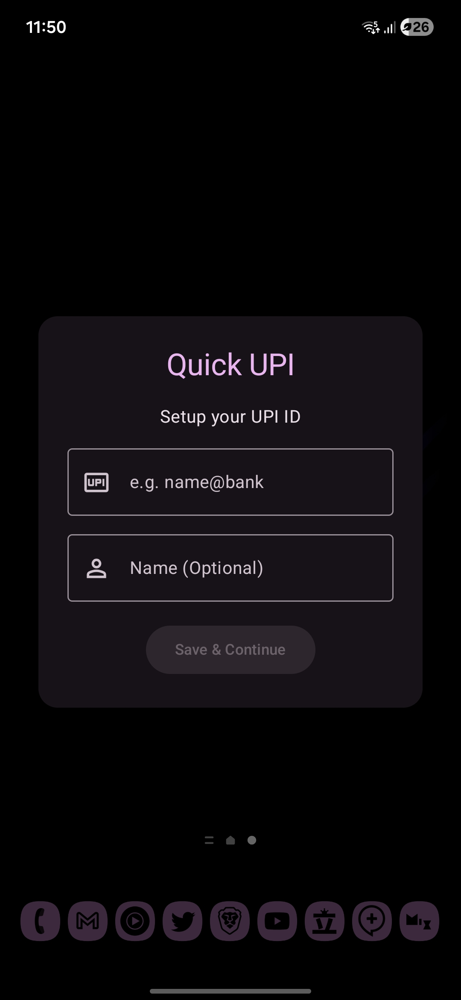
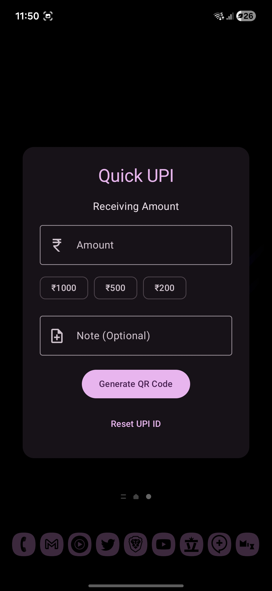
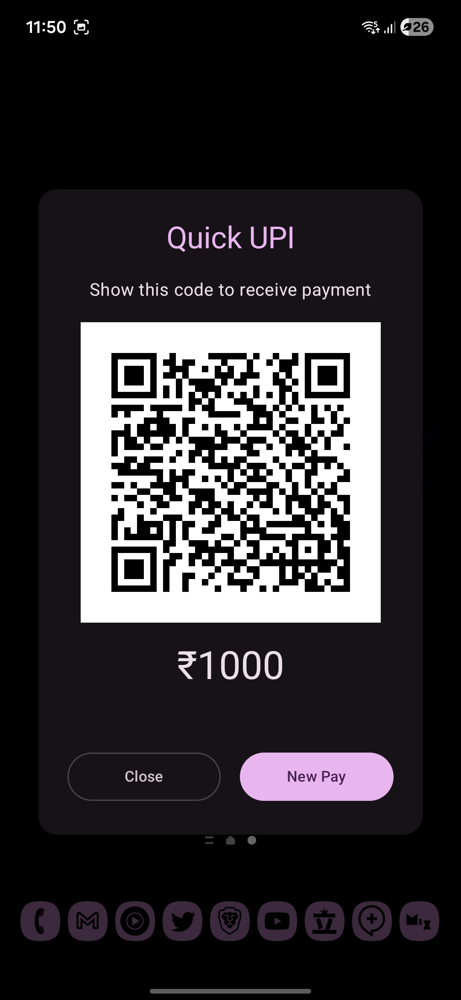
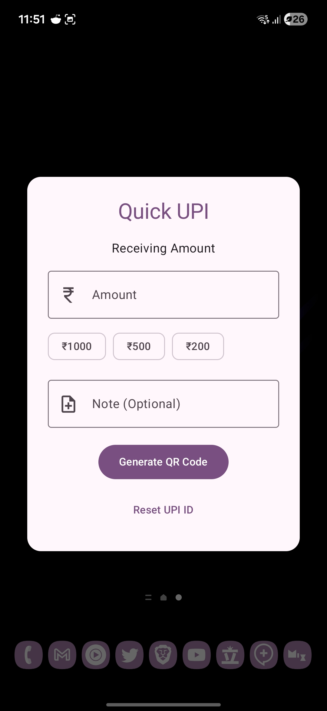

# Quick UPI ⚡

**Stop fumbling. Start receiving.**

Quick UPI is the fastest way to request payments on Android. No more opening heavy banking apps, navigating three menus, and waiting for the "Server Down" message just to show your QR code.

**Two ways to speed:**
1.  Tap the **App Icon** for standard access.
2.  Swipe down and tap the **Quick Settings Tile** for instant access anywhere.

## 📲 Download
<div align="center">
   <a href="https://apt.izzysoft.de/fdroid/index/apk/com.biohazard786.quickupi">
      
   </a>
   <a href="https://github.com/BioHazard786/Quick-UPI/releases">
      
   </a>
   <!-- <a href="https://www.openapk.net/quickupi/com.biohazard786.quickupi/">
      
   </a> -->
   <a href="https://apps.obtainium.imranr.dev/redirect?r=obtainium://add/https://github.com/BioHazard786/Quick-UPI/">
      
   </a>
</div>

## 🚀 Use Cases
*   **📦 Delivery Agents:** Collecting Cash-on-Delivery? Generate a QR for the exact amount in seconds. No more "change nahi hai" disputes.
*   **🚖 Taxi & Auto Drivers:** "Sir, ₹123 hua." Generate a dynamic QR for every ride instead of using a static sticker.
*   **🏪 Small Shop Owners:** Keep the line moving. Type the amount, show the QR, next customer.
*   **💸 The "Split Bill" Speedster:** Dinner's done. You paid. Friends ask, "How much?" Flash a custom QR for exactly ₹550 before they can even unlock their phones.
*   **🔒 The Privacy Pro:** Don't want to shout your phone number in a crowded place? Just show the code.

## ✨ Features
*   **Quick Settings Tile**: Access the app directly from your notification shade.
*   **Instant QR Generation**: Enter amount -> Generate. ZERO lag.
*   **Custom Amounts & Notes**: Add context ("Dinner", "Cab") and exact values.
*   **Recent Amounts**: Smart chips remember your frequently used amounts.
*   **Privacy-First**: No need to share your mobile number.
*   **Material 3 Design**: Sleek, modern, and fits right into your OS.

## 🛠️ Tech Stack
*   **Language**: Kotlin
*   **UI Framework**: Jetpack Compose (Material 3)
*   **Integration**: Android Quick Settings Tile API
*   **QR Generation**: Local generation (No internet required for QR creation)

## 💡 Inspiration
This project was inspired by the simplicity and utility of [WhatsAppNoContact](https://github.com/theolm/WhatsAppNoContact). Just like it solves the friction of messaging without saving contacts, **Quick UPI** solves the friction of receiving payments without navigation.

## 📱 Demo

| **Quick App Launch** | **Quick Settings Tile** |
|:---:|:---:|
|  |  |

## 📸 Screenshots

| | | |
|:---:|:---:|:---:|
|  |  |  |
|  | | |


## 📥 How to Use
1.  **Install the App**.
2.  **Open once** to save your VPA (UPI ID) and Name.
3.  **Swipe Down** your status bar to open Quick Settings.
4.  **Edit** (Pencil icon) and drag the **"Quick UPI"** tile to your active tiles (You can also use app icon to open the app).
5.  **Tap & Get Paid!**

## 🔧 Building Locally
1.  Clone the repo:
    ```bash
    git clone https://github.com/biohazard786/quick-upi.git
    ```
2.  Open in **Android Studio**.
3.  Sync Gradle.
4.  Run on your device/emulator.

## 🤝 Contributing
Issues and Pull Requests are welcome! If you have an idea to make it even faster, let's hear it.

## 📜 License
[MIT](LICENSE)

## 📞 Contact

Mohd Zaid - [Telegram](https://t.me/LuLu786) - [message@zaid.qzz.io](mailto:message@zaid.qzz.io)